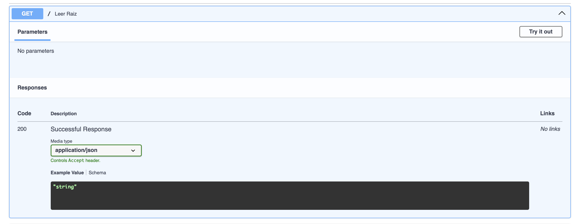
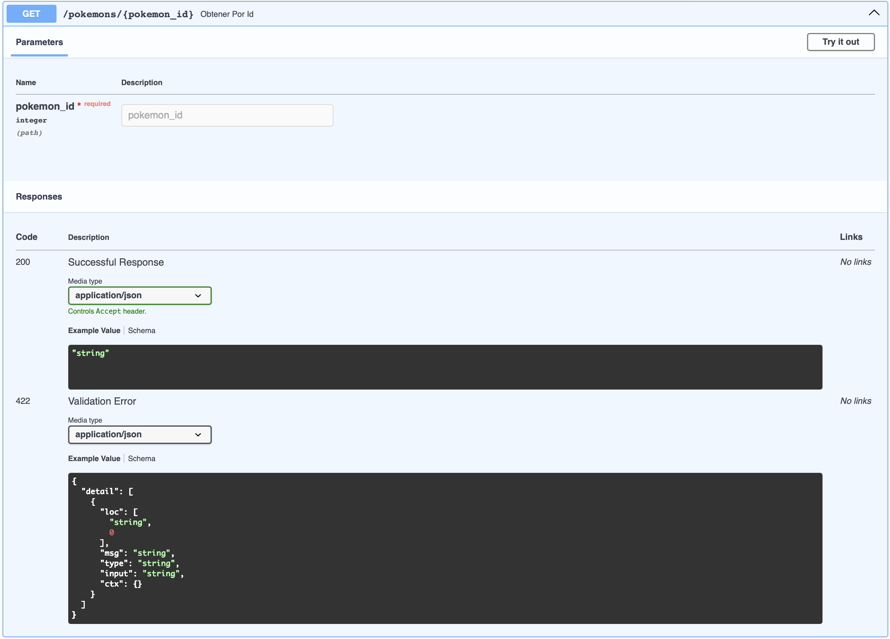
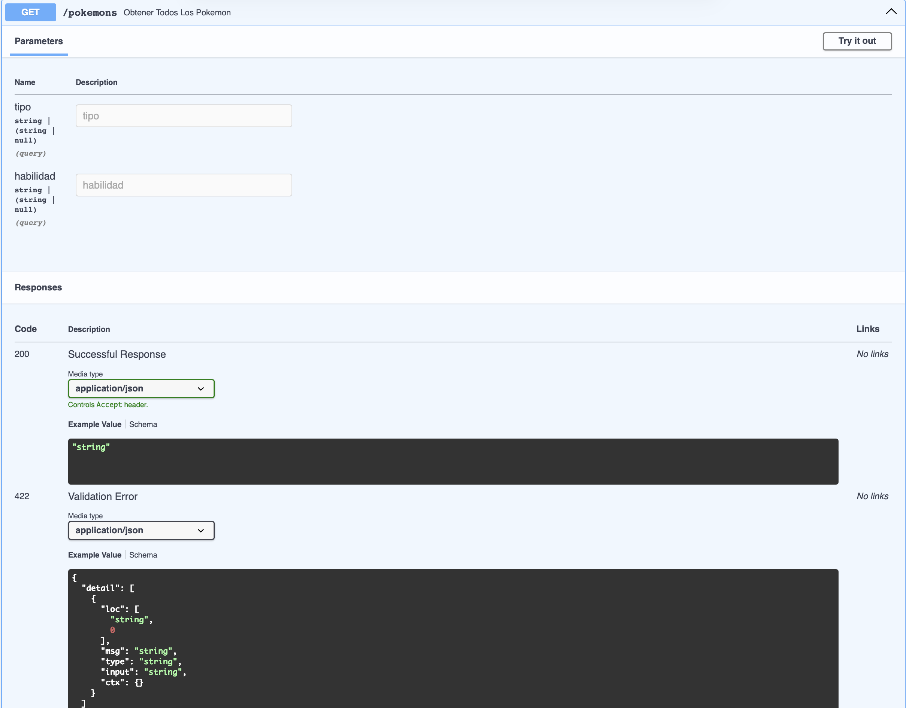
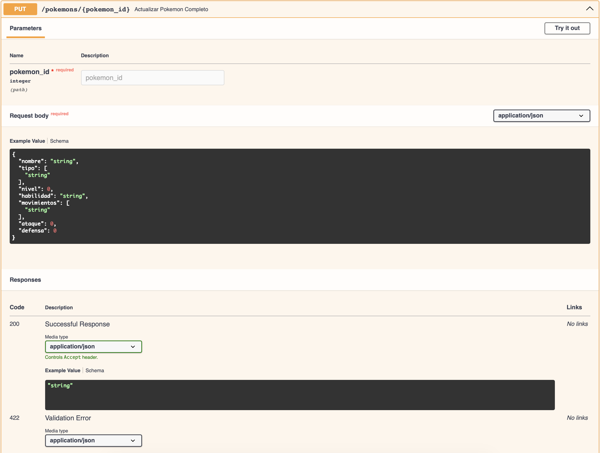
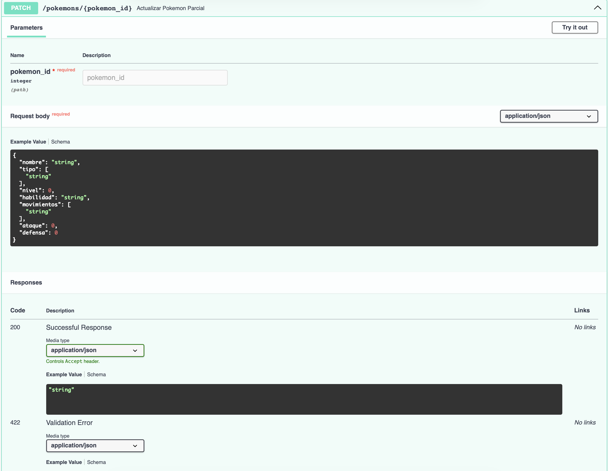
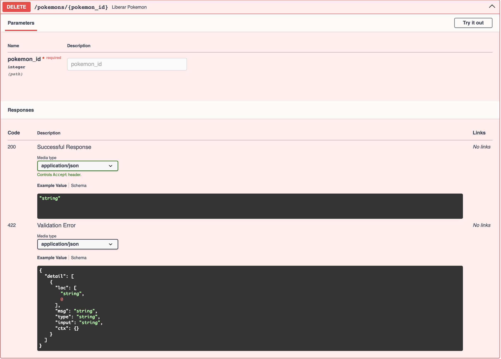
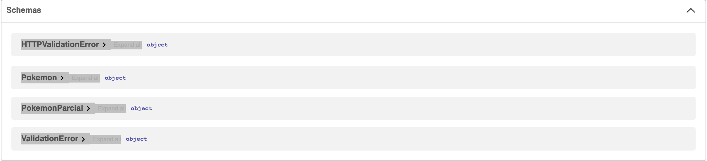

# Pokédex API

API REST desarrollada con FastAPI para consultar y administrar una Pokédex. Permite buscar Pokémon, filtrarlos por tipo o habilidad, registrar nuevos datos, actualizarlos y eliminarlos.

## Requisitos

- Python 3.10 o superior
- FastAPI
- Uvicorn

## Instalación

Clona el repositorio y entra en la carpeta del proyecto:

```bash
git clone https://github.com/epinki07/Pokedex-api.git
cd Pokedex-api
```

Crea y activa un entorno virtual:

```bash
python3 -m venv venv
source venv/bin/activate
```

Instala las dependencias:

```bash
pip install fastapi uvicorn
```

## Ejecución

Inicia el servidor con:

```bash
uvicorn main:app --reload
```

La API estará disponible en `http://127.0.0.1:8000`. La documentación interactiva se puede consultar en `http://127.0.0.1:8000/docs`.

## Endpoints

| Método | Ruta | Descripción |
| --- | --- | --- |
| `GET` | `/` | Muestra el mensaje de bienvenida |
| `GET` | `/pokemons` | Consulta todos los Pokémon |
| `GET` | `/pokemons/{pokemon_id}` | Consulta un Pokémon por su ID |
| `POST` | `/pokemon/{pokemon_id}` | Registra un Pokémon |
| `PUT` | `/pokemons/{pokemon_id}` | Reemplaza todos los datos de un Pokémon |
| `PATCH` | `/pokemons/{pokemon_id}` | Actualiza uno o varios datos de un Pokémon |
| `DELETE` | `/pokemons/{pokemon_id}` | Elimina un Pokémon que no sea inicial |

La consulta general acepta los parámetros opcionales `tipo` y `habilidad`:

```text
GET /pokemons?tipo=agua
GET /pokemons?habilidad=torrente
GET /pokemons?tipo=agua&habilidad=torrente
```

## Reglas de negocio

Los Pokémon iniciales están protegidos y no pueden eliminarse:

- Bulbasaur: ID `1`
- Charmander: ID `4`
- Squirtle: ID `7`

Si se intenta eliminar alguno de ellos, la API responde con el código `403 Forbidden` y el mensaje:

```json
{
  "detail": "No tienes permiso para eliminar un Pokemon inicial."
}
```

Cuando el ID solicitado no existe, la API responde con el código `404 Not Found`.

## Capturas de la API

<details>
<summary>Endpoint de inicio</summary>



</details>

<details>
<summary>Consulta por ID</summary>



</details>

<details>
<summary>Consulta con filtros</summary>



</details>

<details>
<summary>Actualización completa</summary>



</details>

<details>
<summary>Actualización parcial</summary>



</details>

<details>
<summary>Eliminación de un Pokémon</summary>



</details>

<details>
<summary>Esquemas de datos</summary>



</details>

## Ejemplo de registro

Petición:

```http
POST /pokemon/25
Content-Type: application/json
```

```json
{
  "nombre": "Pikachu",
  "tipo": ["Eléctrico"],
  "nivel": 10,
  "habilidad": "Electricidad Estática",
  "movimientos": ["Impactrueno", "Ataque Rápido"],
  "ataque": 55,
  "defensa": 40
}
```

## Nota

Los datos se almacenan temporalmente en memoria. Al reiniciar el servidor, la Pokédex vuelve a su estado inicial.
